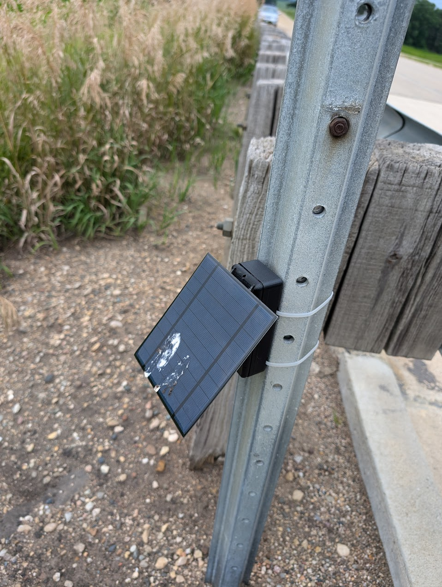

# Rf-Trail-Cam
Capturing RF signals in the Wild

The code found in this repo can be combined with a Lilygo Sim7000G to create an RF Trail Cam.

When propely setup and configured the RF Trail cam will scan for wifi and upload new networks it sees to the server defined in the app.py code
the webinterface will show:
Heartbeats from all the the devices that have uploaded to it which contain their MAC addresses and the batteries current voltage level
A map of where the wifi networks were observed
A list of all the networks in a wigle compatible table under the map

Users can log into the site and once they've done that they have the option to either delete the existing networks from the database or upload any new networks directly to Wigle.com

You need to install all the python libraries seen in at the top of the app.py file
You then need to update the username and password for logging in
You then need to enter your own wigle API key

Then put the index.html file into a sub solder of the wherever the app.py lives called templates

Flash the esp32 code onto the LilyGo Sim 7000G, making sure to change the APN to the one your cell provider uses as well as the IP address and port of the unit should upload to.

